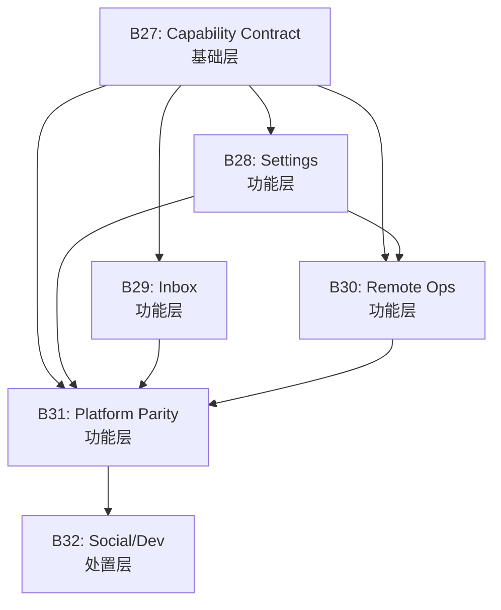

# Wave 10 主方案 - Master Plan

> **状态**: 规划中  
> **范围**: packages/vibe-app-tauri  
> **目标**: 缩小 route 覆盖率与 product-contract 完成度之间的差距

---

## 1. 需求重述 (Requirements Restatement)

### 1.1 核心目标
Wave 10 的核心使命是**将 `vibe-app-tauri` 从"路由覆盖完成"转变为"产品契约完成"**。具体包括：

1. **建立能力分类体系**: 为所有可见的 app surfaces 定义清晰的 capability classes
2. **消除过度承诺**: 移除或降级任何暗示未支持完成度的措辞
3. **统一产品叙事**: 确保所有 surfaces 使用一致的术语、状态和行为模式
4. **明确平台边界**: 为 desktop/Android/browser 分别定义 support contracts

### 1.2 成功标准
- 所有可见路由都有明确的支持等级分类
- 活动文档不再夸大 app 产品状态
- 平台差异在语言和功能上都是显式的
- 后续 Wave 10 模块可以使用本模块的规则进行输出分类

---

## 2. 架构概览 (Architecture Overview)

### 2.1 六大模块及其关系

```
┌─────────────────────────────────────────────────────────────────────┐
│                     Wave 10 架构                                     │
├─────────────────────────────────────────────────────────────────────┤
│                                                                      │
│  ┌───────────────────────────────────────┐                          │
│  │ B27: Capability Contract             │  ← 基础层               │
│  │ (validation-and-customer-            │     定义分类体系        │
│  │  capability-contract)                │                          │
│  └──────────────┬────────────────────────┘                          │
│                 │                                                    │
│    ┌────────────┼────────────┬────────────┐                         │
│    ▼            ▼            ▼            ▼                         │
│ ┌──────┐   ┌───────┐   ┌────────┐   ┌──────────┐                   │
│ │ B28  │   │ B29   │   │  B30   │   │   B31    │  ← 功能层       │
│ │Setting│   │ Inbox │   │ Remote │   │ Platform │                  │
│ │-conn  │   │ -notif│   │ -ops   │   │ -parity  │                  │
│ └───────┘   └───────┘   └────────┘   └──────────┘                  │
│                                             │                       │
│                                             ▼                       │
│                                      ┌──────────┐                  │
│                                      │   B32    │  ← 处置层       │
│                                      │ Social/  │                  │
│                                      │ Developer│                  │
│                                      │ Surfaces │                  │
│                                      └──────────┘                  │
│                                                                      │
└─────────────────────────────────────────────────────────────────────┘
```

### 2.2 模块依赖关系

```
B27 (Foundation)
  ├──► B28 (Settings)
  ├──► B29 (Inbox)
  ├──► B30 (Remote Ops)
  │     └──► B31 (Platform)
  │            └──► B32 (Social/Developer)
  └──► B31 (Platform - direct dependency)
```

---

## 3. Batch 分配与详细方案

### B27: Validation and Customer Capability Contract
**状态**: Planned | **依赖**: 无 (基础模块)

#### 目标
建立 Wave 10 的基础能力分类体系，定义每个可见 app surface 的 capability classes 和所需的证据类型。

#### 实现阶段

**Phase 1: Capability Classification Model (2天)**
- [ ] 创建 `CapabilityClass` 枚举: `FullySupported`, `Limited`, `HandoffOnly`, `ReadOnly`, `Internal`, `Unsupported`
- [ ] 定义 `CapabilityEvidence` 接口: codePath, statePath, tests, platformScope
- [ ] 创建 `SurfaceCapability` 类型定义
- [ ] 编写分类决策树文档

**Phase 2: Evidence Requirements Definition (2天)**
- [ ] 为每个 capability class 定义所需证据清单
- [ ] 创建证据检查表模板
- [ ] 编写证据收集指南
- [ ] 定义证据审查流程

**Phase 3: Documentation Rewrite (3天)**
- [ ] 重写 `docs/plans/rebuild/STATUS.md` 使用新 contract
- [ ] 更新 `README.md` 移除过度承诺的措辞
- [ ] 重写 `CLAUDE.md` 的 capability 相关部分
- [ ] 创建 `CAPABILITY-CONTRACT.md` 主文档

**Phase 4: Validation (1天)**
- [ ] 审查所有活动文档的一致性
- [ ] 验证 validation 命令清单
- [ ] 执行文档一致性检查

#### 验收标准
- [ ] 仓库有单一的 app 完成度定义
- [ ] 活动文档不再夸大 app 产品状态
- [ ] 后续 Wave 10 模块可以使用本模块的规则进行输出分类

#### 风险评估
| 风险 | 等级 | 缓解措施 |
|------|------|----------|
| 分类模型过于复杂 | MEDIUM | 保持5-6个类别，避免过度工程 |
| 文档重写范围蔓延 | HIGH | 严格限定在活动文档范围内 |
| 团队接受度 | MEDIUM | 提前与利益相关者审查模型 |

---

### B28: Settings and Connection Center
**状态**: Planned | **依赖**: B27

#### 目标
将当前 settings 区域从混杂的 preferences、retained helper pages 和 handoff-only flows 转变为一个连贯的产品 surface。

#### 实现阶段

**Phase 1: Settings Route Audit (2天)**
- [ ] 审查所有 settings 路由代码
- [ ] 根据 B27 的分类模型分类每个 route
- [ ] 识别 helper-only vs fully supported surfaces
- [ ] 创建 settings route 清单

**Phase 2: Connection Center Lifecycle Design (3天)**
- [ ] 设计 connection-center 状态机
- [ ] 定义 vendor/service 连接状态流转
- [ ] 设计用户反馈模型
- [ ] 创建连接生命周期文档

**Phase 3: Route Reclassification (3天)**
- [ ] 重写 settings 路由 copy
- [ ] 更新 state handling 和 visibility rules
- [ ] 分类: fully supported, limited, handoff-only sections
- [ ] 更新 route 文档

**Phase 4: Integration (2天)**
- [ ] 实现 connection-center 逻辑
- [ ] 集成新的分类系统
- [ ] 执行 settings 路由测试
- [ ] 执行一致性审查

#### 验收标准
- [ ] 每个可见 settings 路由都有清晰的支持等级分类
- [ ] connection-center 路由不再像未完成的集成
- [ ] settings copy 准确描述什么保存在本地、远程或需要外部步骤

#### 风险评估
| 风险 | 等级 | 缓解措施 |
|------|------|----------|
| 与现有设置数据兼容性问题 | HIGH | 实现数据迁移策略 |
| vendor 集成复杂度 | MEDIUM | 限制 Wave 10 范围内的新集成 |
| 用户体验中断 | MEDIUM | 保持关键设置的可访问性 |

---

### B29: Inbox and Notification Closure
**状态**: Planned | **依赖**: B27

#### 目标
为 inbox、feed、unread state、local alerts 和 notification-driven navigation 定义真实的产品契约。

#### 实现阶段

**Phase 1: Taxonomy Design (2天)**
- [ ] 设计 inbox、feed、notification 对象分类法
- [ ] 定义 unread 语义
- [ ] 创建 event source taxonomy (session, relationship, artifact, terminal, system)
- [ ] 编写 taxonomy 文档

**Phase 2: Notification Source Definition (2天)**
- [ ] 定义支持的 notification sources
- [ ] 定义 platform scope (desktop local, Android push, etc.)
- [ ] 分类当前 events: user-visible vs internal
- [ ] 创建 notification source 清单

**Phase 3: State Management (3天)**
- [ ] 设计 unread/read state 管理
- [ ] 实现 inbox 状态机
- [ ] 实现 feed 过滤逻辑
- [ ] 编写状态管理文档

**Phase 4: UI Alignment (2天)**
- [ ] 对齐 copy、route structure
- [ ] 更新 validation
- [ ] 执行分类审查
- [ ] 创建 notification UI 指南

#### 验收标准
- [ ] inbox 和 notification 行为由单一连贯的契约描述
- [ ] 活动文档可以解释支持的 notification 行为而不需要含糊其辞
- [ ] platform 差异对于 notification 交付和 routing 是明确的

#### 风险评估
| 风险 | 等级 | 缓解措施 |
|------|------|----------|
| 与现有 notification 系统集成复杂度 | HIGH | 逐步替换，保持向后兼容 |
| Android push 集成不确定性 | MEDIUM | 先实现桌面端，Android 后续迭代 |
| 用户习惯改变阻力 | MEDIUM | 提供迁移指南和过渡提示 |

---

### B30: Remote Operations Surfaces
**状态**: Planned | **依赖**: B27, B28

#### 目标
将当前的 terminal、machine、server 和相关 helper routes 转变为一个明确的 remote-operations 工作流。

#### 实现阶段

**Phase 1: Workflow Definition (2天)**
- [ ] 定义 remote operations 用户工作流
- [ ] 绘制当前 helper surfaces 流程图
- [ ] 识别用户痛点
- [ ] 编写 workflow 文档

**Phase 2: Route Reclassification (3天)**
- [ ] 分类每个 route: supported workflow step, limited helper, internal utility
- [ ] 创建 route classification 清单
- [ ] 定义 route relationships (session, machine, terminal)
- [ ] 编写 reclassification 报告

**Phase 3: Navigation Alignment (2天)**
- [ ] 对齐 navigation 结构
- [ ] 更新 copy
- [ ] 确保 route set 读取为统一产品 flow
- [ ] 创建 navigation 指南

**Phase 4: Platform Documentation (2天)**
- [ ] 记录 platform 差异
- [ ] 更新 helper 可用性文档
- [ ] 执行一致性审查
- [ ] 创建 platform 差异矩阵

#### 验收标准
- [ ] remote-operation helper routes 讲述一个连贯的故事
- [ ] 客户安全的措辞区分支持的 remote actions 和 helper-only actions
- [ ] route visibility 和 platform scope 匹配生成的工作流定义

#### 风险评估
| 风险 | 等级 | 缓解措施 |
|------|------|----------|
| Terminal 集成功能限制 | HIGH | 明确记录限制，提供替代方案 |
| Machine 管理后端依赖 | MEDIUM | 与后端团队协调接口 |
| 跨平台行为差异 | MEDIUM | 清晰的平台特定文档 |

---

### B31: Platform Parity and Browser Contract
**状态**: Planned | **依赖**: B28, B29, B30

#### 目标
用 per-surface desktop/Android/browser support contract 替换 broad multi-platform completion claims。

#### 实现阶段

**Phase 1: Support Matrix Design (2天)**
- [ ] 构建 Wave 10 support matrix
- [ ] 分类每个 surface per platform
- [ ] 定义分类: complete, limited, handoff-only, read-only, unsupported
- [ ] 创建 support matrix 文档

**Phase 2: Platform Classification (3天)**
- [ ] 详细定义 desktop support boundaries
- [ ] 详细定义 Android support boundaries
- [ ] 定义 browser-export contract
- [ ] 创建 platform boundaries 文档

**Phase 3: Documentation Rewrite (2天)**
- [ ] 重写 platform wording 匹配 matrix
- [ ] 移除 vague "multi-platform complete" wording
- [ ] 更新所有平台相关文档
- [ ] 创建 platform wording 指南

**Phase 4: Verification (2天)**
- [ ] 审查 support matrix 对比 actual code
- [ ] 验证 documentation consistency
- [ ] 执行 smoke coverage review
- [ ] 创建 verification report

#### 验收标准
- [ ] desktop/Android/browser support claims 是按 surface 明确的
- [ ] 活动文档不再使用模糊的 "multi-platform complete" 措辞
- [ ] browser-export support 以有界、可测试的方式描述

#### 风险评估
| 风险 | 等级 | 缓解措施 |
|------|------|----------|
| 平台间功能差异导致用户困惑 | HIGH | 清晰的平台特定UI提示 |
| Android 支持边界定义不清 | MEDIUM | 与移动端团队对齐 |
| Browser export 限制影响用户期望 | MEDIUM | 明确文档说明限制 |

---

### B32: Social and Developer Surface Disposition
**状态**: Planned | **依赖**: B31

#### 目标
解决 social 和 developer-only surfaces 的产品状态，使其停止处于已实现代码、计划路由和客户可见声明之间的模糊状态。

#### 实现阶段

**Phase 1: Surface Audit (2天)**
- [ ] 审查 social surfaces (friends, social features)
- [ ] 审查 developer-only routes (dev tools, internal pages)
- [ ] 评估当前代码状态
- [ ] 评估业务价值
- [ ] 创建 surface audit 报告

**Phase 2: Disposition Decision (2天)**
- [ ] 决定 social surfaces: productize, hide, or defer
- [ ] 决定 developer-only routes: exposed, hidden, or internal-only
- [ ] 与利益相关者审查决策
- [ ] 创建 disposition decision 文档

**Phase 3: Implementation (3天)**
- [ ] 更新 route visibility 匹配决策
- [ ] 更新 docs 匹配决策
- [ ] 移除任何残留措辞暗示这些 surfaces 是当前承诺
- [ ] 创建 implementation report

**Phase 4: Verification (1天)**
- [ ] 审查所有 social 和 developer surfaces 的 route visibility
- [ ] 审查 customer-facing capability list
- [ ] 执行 final verification
- [ ] 创建 verification report

#### 验收标准
- [ ] social 和 developer surfaces 有明确的处置决策
- [ ] 活动文档和可见导航反映这些决策
- [ ] 没有模糊的 "present but not really supported" route family 保留

#### 风险评估
| 风险 | 等级 | 缓解措施 |
|------|------|----------|
| 利益相关者对 social features 优先级分歧 | HIGH | 提前与产品团队对齐 |
| Developer routes 被误用 | MEDIUM | 清晰的文档和访问控制 |
| 隐藏功能引起用户困惑 | MEDIUM | 清晰的通信和迁移路径 |

---

## 4. 依赖关系图



---

## 5. 风险评估矩阵

| Batch | 主要风险 | 等级 | 缓解策略 |
|-------|---------|------|---------|
| B27 | 分类模型过于复杂 | MEDIUM | 保持5-6个类别，避免过度工程 |
| B28 | 与现有设置数据兼容性问题 | HIGH | 实现数据迁移策略 |
| B29 | 与现有 notification 系统集成复杂度 | HIGH | 逐步替换，保持向后兼容 |
| B30 | Terminal 集成功能限制 | HIGH | 明确记录限制，提供替代方案 |
| B31 | 平台间功能差异导致用户困惑 | HIGH | 清晰的平台特定UI提示 |
| B32 | 利益相关者对 social features 优先级分歧 | HIGH | 提前与产品团队对齐 |

---

## 6. 验收标准总览

### G8: Wave 10 Planning Tree Active
- [ ] Wave 10 planning tree exists and is the active source of truth
- [ ] All six module plans are documented and approved

### G9: Customer-Visible Claims Backed
- [ ] Customer-visible capability claims are backed by code and platform scope
- [ ] No over-promising language remains in active docs

### G10: Clear Product Contracts
- [ ] Settings, notifications, and remote-operations surfaces expose clear product contracts
- [ ] Each surface has explicit support level classification

### G11: Platform Support Explicit
- [ ] Desktop/Android/browser support claims are explicit and evidence-backed
- [ ] No vague "multi-platform complete" wording remains

### G12: Social/Dev Surfaces Classified
- [ ] Social and developer-only surfaces are formally classified
- [ ] No ambiguous "present but not really supported" route families remain

### G13: Docs Reflect Wave 10 Standard
- [ ] Active docs and validation commands reflect the Wave 10 standard
- [ ] All planning docs are up-to-date with implementation status

---

## 7. 工作量估算

| Batch | 任务数 | 预估工作量 | 主要角色 |
|-------|--------|-----------|---------|
| B27 | 16 | 8 天 | Tech Lead + PM |
| B28 | 14 | 10 天 | Frontend Engineer |
| B29 | 14 | 9 天 | Frontend Engineer |
| B30 | 14 | 9 天 | Full-stack Engineer |
| B31 | 14 | 9 天 | Tech Lead |
| B32 | 12 | 8 天 | PM + Tech Lead |
| **总计** | **84** | **53 天** | **多角色协作** |

---

## 8. 下一步行动

1. **确认本方案**: 审查并批准 Wave 10 Master Plan
2. **启动 B27**: 开始 implementation of validation-and-customer-capability-contract
3. **资源分配**: 为各 Batch 分配工程师
4. **设立检查点**: 每周审查进度，每 Batch 完成后执行 Gate review

---

**文档版本**: 1.0  
**创建日期**: 2026-04-11  
**状态**: 待审批
