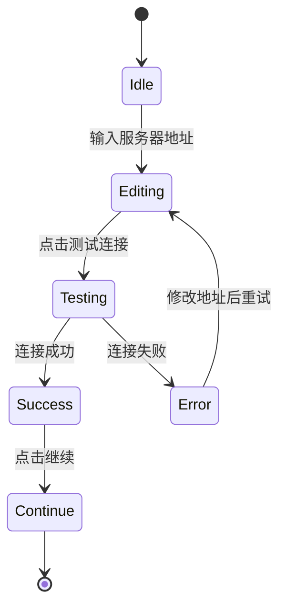
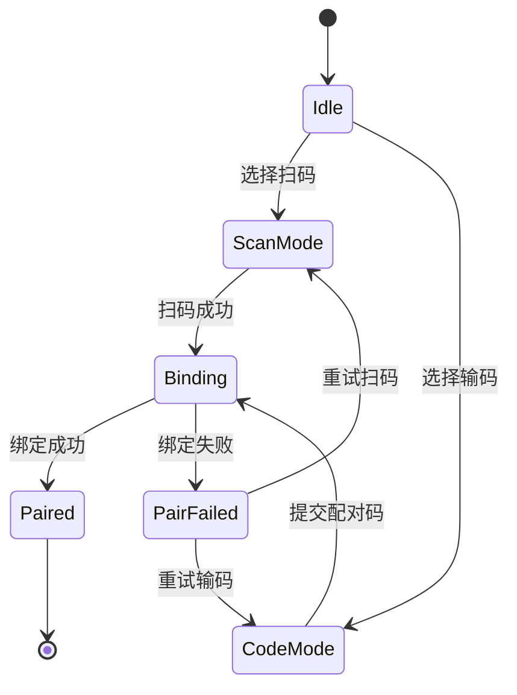
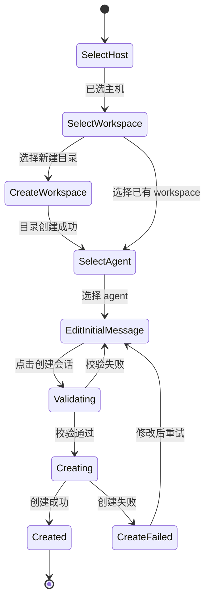
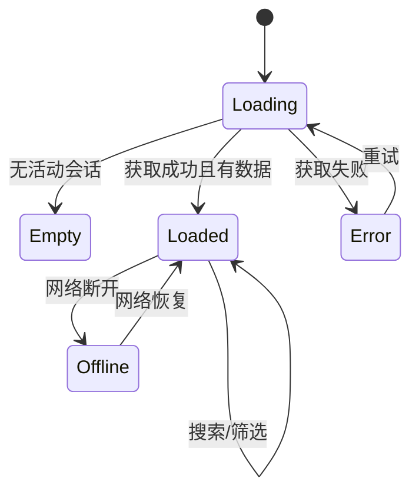
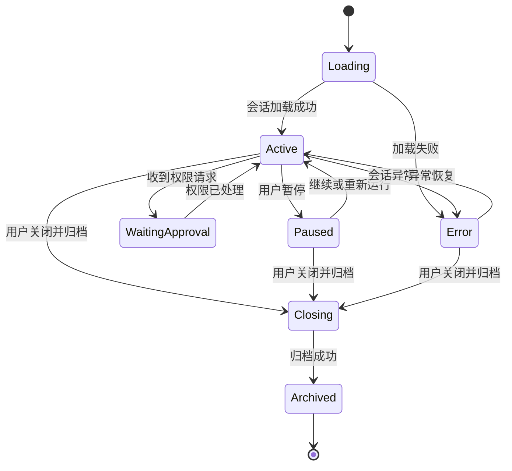
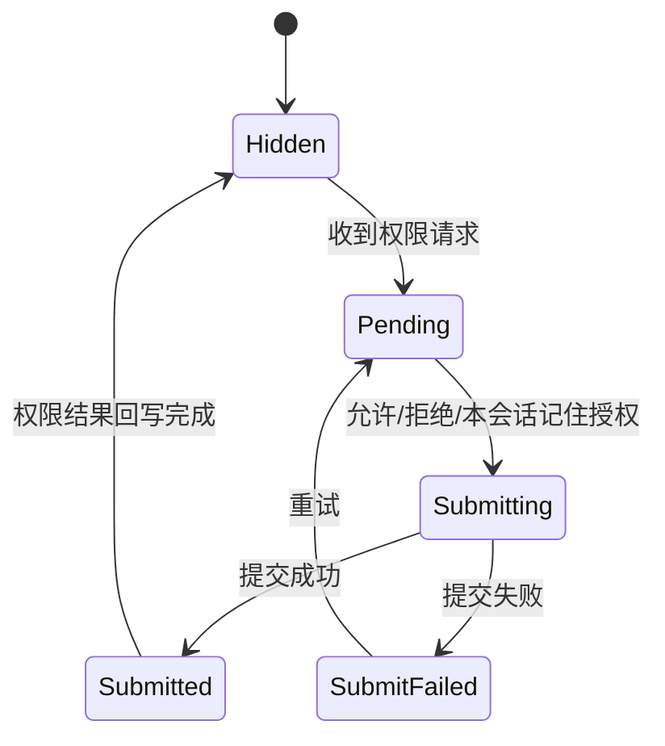
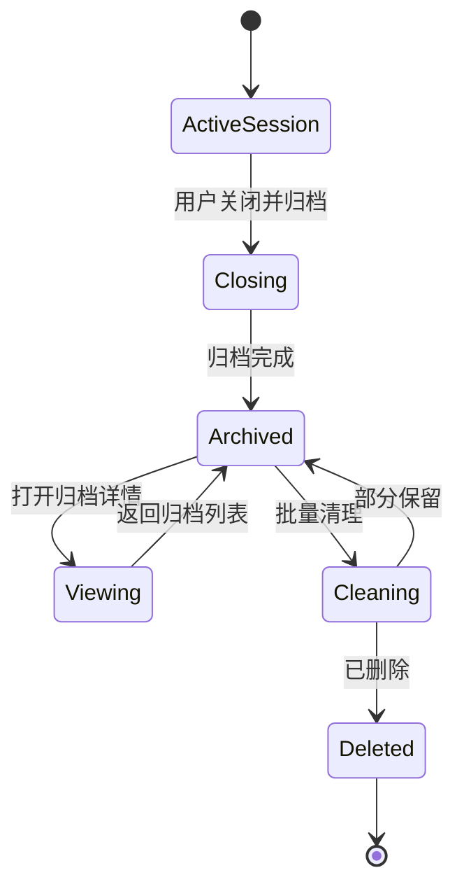
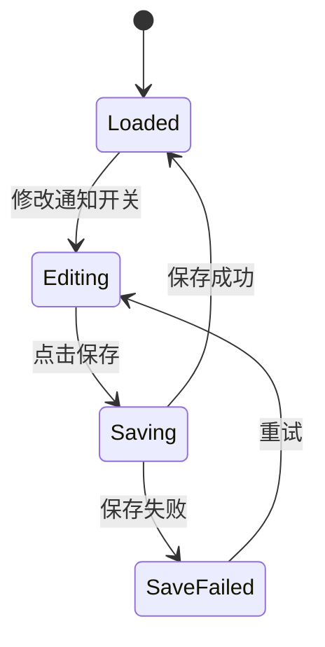

# Vibe Everywhere 页面字段清单与状态机

## 1. 文档目的

本文档基于 `需求文档.md`、`页面信息架构与交互说明.md` 和 `低保真线框文档.md`，继续细化首发版本的页面级字段清单与关键状态机，用于：

- 产品侧补齐页面字段定义
- 设计侧明确页面状态与交互分支
- 前端侧拆页面、拆组件、定义本地状态
- 后端侧反推接口返回结构与事件类型

本文档聚焦首发版本，不覆盖多用户、企业能力和复杂编辑器场景。

## 2. 通用对象字段

为避免各页面重复定义，先统一约定核心对象。

## 2.1 ServerConfig

| 字段 | 类型 | 必填 | 说明 |
|---|---|---:|---|
| server_url | string | 是 | 用户配置的服务器地址 |
| connection_status | enum | 是 | `idle` / `testing` / `connected` / `failed` |
| last_test_time | datetime | 否 | 最近测试连接时间 |
| last_error_message | string | 否 | 最近一次连接失败信息 |

## 2.2 ClientDevice

| 字段 | 类型 | 必填 | 说明 |
|---|---|---:|---|
| device_id | string | 是 | 当前客户端设备唯一标识 |
| device_name | string | 是 | 设备名称，如 iPhone 16 Pro / MacBook Pro |
| device_type | enum | 是 | `mobile` / `desktop` |
| authorized_at | datetime | 是 | 设备授权时间 |
| server_url | string | 是 | 当前连接服务器地址 |

## 2.3 Host

| 字段 | 类型 | 必填 | 说明 |
|---|---|---:|---|
| host_id | string | 是 | 主机唯一标识 |
| host_name | string | 是 | 主机显示名称 |
| platform | enum | 是 | `linux` / `macos` / `wsl` |
| online_status | enum | 是 | `online` / `offline` / `unknown` |
| daemon_status | enum | 是 | `healthy` / `connecting` / `disconnected` / `error` |
| last_active_at | datetime | 否 | 最近活跃时间 |
| pair_status | enum | 是 | `paired` / `pending` / `failed` |
| pair_code | string | 否 | 配对码，仅配对中临时存在 |
| qr_payload | string | 否 | 二维码载荷，仅配对中存在 |

## 2.4 Workspace

| 字段 | 类型 | 必填 | 说明 |
|---|---|---:|---|
| workspace_id | string | 是 | workspace 唯一标识 |
| host_id | string | 是 | 所属主机 |
| path | string | 是 | 远程目录路径 |
| display_name | string | 是 | 展示名称，默认可取目录名 |
| is_favorited | boolean | 是 | 是否收藏 |
| last_used_at | datetime | 否 | 最近使用时间 |
| exists | boolean | 是 | 目录当前是否存在 |

## 2.5 Session

| 字段 | 类型 | 必填 | 说明 |
|---|---|---:|---|
| session_id | string | 是 | 会话唯一标识 |
| title | string | 是 | 会话标题 |
| host_id | string | 是 | 所属主机 |
| workspace_id | string | 是 | 所属 workspace |
| agent_type | string | 是 | `claude_code` 或其他 ACP agent |
| status | enum | 是 | `running` / `waiting_approval` / `paused` / `error` / `closing` / `archived` |
| last_activity_at | datetime | 否 | 最近活跃时间 |
| latest_summary | string | 否 | 最近状态摘要 |
| unread_event_count | integer | 是 | 未读事件数 |
| pending_permission_count | integer | 是 | 待处理权限数 |
| can_resume_cross_device | boolean | 是 | 是否可跨端接力 |

## 2.6 SessionArchive

| 字段 | 类型 | 必填 | 说明 |
|---|---|---:|---|
| archive_id | string | 是 | 归档唯一标识 |
| session_id | string | 是 | 原会话标识 |
| title | string | 是 | 会话标题 |
| closed_at | datetime | 是 | 关闭时间 |
| close_reason | enum | 是 | `user_closed` / `completed` / `failed` / `terminated` |
| host_id | string | 是 | 原所属主机 |
| workspace_id | string | 是 | 原所属 workspace |

## 2.7 PermissionRequest

| 字段 | 类型 | 必填 | 说明 |
|---|---|---:|---|
| permission_id | string | 是 | 权限请求唯一标识 |
| session_id | string | 是 | 所属会话 |
| risk_type | enum | 是 | `write_fs` / `exec_cmd` / `network` |
| summary | string | 是 | 动作摘要 |
| target | string | 否 | 目标路径、命令或域名 |
| created_at | datetime | 是 | 发起时间 |
| status | enum | 是 | `pending` / `approved_once` / `denied_once` / `approved_session` / `expired` |

## 2.8 NotificationPreference

| 字段 | 类型 | 必填 | 说明 |
|---|---|---:|---|
| enabled | boolean | 是 | 是否启用通知 |
| permission_request_enabled | boolean | 是 | 是否推送权限请求 |
| task_completed_enabled | boolean | 是 | 是否推送任务完成 |
| task_failed_enabled | boolean | 是 | 是否推送任务失败 |
| session_error_enabled | boolean | 是 | 是否推送会话异常 |

## 3. 页面字段清单

以下按页面逐个列出字段、动作和主要状态。

## 3.1 手机端页面字段

### M-01 服务器地址配置页

**页面用途**

- 首次输入服务器地址
- 修改服务器地址
- 测试连接

**展示字段**

| 字段 | 来源对象 | 说明 |
|---|---|---|
| server_url | ServerConfig | 当前输入或已保存的服务器地址 |
| connection_status | ServerConfig | 当前连接状态 |
| last_error_message | ServerConfig | 最近失败原因 |
| last_test_time | ServerConfig | 最近测试连接时间 |

**交互字段**

| 字段/动作 | 类型 | 说明 |
|---|---|---|
| server_url_input | 输入 | 服务器地址输入框 |
| test_connection | 按钮 | 测试连接 |
| continue_action | 按钮 | 继续下一步 |

**页面状态**

- `idle`
- `testing`
- `success`
- `error`

### M-02 主机配对页

**展示字段**

| 字段 | 来源对象 | 说明 |
|---|---|---|
| pair_mode | 本地状态 | `scan` / `code_input` |
| pair_code | Host | 用户输入的配对码 |
| last_pair_result | 本地状态 | 最近绑定结果 |

**交互字段**

| 字段/动作 | 类型 | 说明 |
|---|---|---|
| open_camera | 按钮 | 打开扫码 |
| pair_code_input | 输入 | 输入配对码 |
| submit_pair | 按钮 | 提交绑定 |

**页面状态**

- `idle`
- `scanning`
- `code_inputting`
- `binding`
- `paired`
- `pair_failed`

### M-03 活动会话列表页

**展示字段**

| 字段 | 来源对象 | 说明 |
|---|---|---|
| search_keyword | 本地状态 | 搜索关键词 |
| need_attention_sessions | Session[] | 待审批或异常会话 |
| running_sessions | Session[] | 运行中会话 |
| paused_sessions | Session[] | 暂停中会话 |

**会话卡片字段**

| 字段 | 来源对象 | 说明 |
|---|---|---|
| title | Session | 会话名称 |
| host_name | Host | 所属主机名 |
| workspace_name | Workspace | workspace 展示名 |
| agent_type | Session | agent 类型 |
| status | Session | 当前状态 |
| latest_summary | Session | 最新摘要 |
| last_activity_at | Session | 最近活跃时间 |
| pending_permission_count | Session | 待审批数量 |

**页面状态**

- `loading`
- `empty`
- `loaded`
- `offline`
- `error`

### M-04 新建会话页

**展示字段**

| 字段 | 来源对象 | 说明 |
|---|---|---|
| selected_host_id | 本地状态 | 已选主机 |
| selected_workspace_id | 本地状态 | 已选 workspace |
| create_mode | 本地状态 | `pick_existing` / `create_new` |
| new_workspace_path | 本地状态 | 新目录路径 |
| selected_agent_type | 本地状态 | 默认 `claude_code` |
| initial_message | 本地状态 | 首条消息 |

**交互动作**

| 动作 | 说明 |
|---|---|
| choose_host | 选择主机 |
| choose_existing_workspace | 选择已有 workspace |
| create_new_workspace | 创建新目录 |
| choose_agent | 选择 agent |
| submit_create_session | 创建会话 |

**页面状态**

- `editing`
- `validating`
- `creating`
- `created`
- `create_failed`

### M-05 会话详情页

**顶部字段**

| 字段 | 来源对象 | 说明 |
|---|---|---|
| title | Session | 会话标题 |
| host_name | Host | 主机名 |
| workspace_name | Workspace | workspace 名称 |
| agent_type | Session | agent 类型 |
| status | Session | 当前状态 |
| connection_hint | 本地状态 | 连接状态提示 |

**标签页字段**

| 标签 | 说明 |
|---|---|
| overview | 概览 |
| logs | 日志 |
| diff | 变更 |
| files | 文件树 |

**底部输入区字段**

| 字段 | 类型 | 说明 |
|---|---|---|
| message_input | 输入 | 文本消息或命令输入 |
| send_action | 按钮 | 发送 |

**更多菜单动作**

| 动作 | 说明 |
|---|---|
| pause_session | 暂停 |
| terminate_session | 终止 |
| interrupt_task | 中断当前任务 |
| rerun_task | 重新运行 |
| close_and_archive | 关闭并归档 |

**页面状态**

- `loading`
- `active`
- `waiting_approval`
- `paused`
- `error`
- `closing`

### M-05-1 会话概览标签

**字段**

| 字段 | 来源对象 | 说明 |
|---|---|---|
| latest_agent_reply | 本地聚合 | 最近一条回复摘要 |
| latest_events | 事件流 | 最近事件列表 |
| latest_diff_summary | 会话聚合 | 最新 diff 摘要 |
| latest_permission_summary | PermissionRequest | 最新权限请求摘要 |
| latest_error | 会话聚合 | 最近错误 |

### M-05-2 会话日志标签

**字段**

| 字段 | 来源对象 | 说明 |
|---|---|---|
| log_search_keyword | 本地状态 | 日志搜索关键词 |
| auto_scroll_enabled | 本地状态 | 是否自动滚动 |
| log_items | 事件流 | 时间序日志列表 |

### M-05-3 会话变更标签

**字段**

| 字段 | 来源对象 | 说明 |
|---|---|---|
| changed_files | 会话聚合 | 变更文件列表 |
| selected_changed_file | 本地状态 | 当前打开的变更文件 |
| diff_search_keyword | 本地状态 | diff 检索词 |
| current_file_diff | 会话聚合 | 当前文件 diff 内容 |

### M-05-4 文件树标签

**字段**

| 字段 | 来源对象 | 说明 |
|---|---|---|
| file_tree_search_keyword | 本地状态 | 文件路径搜索 |
| file_tree_nodes | 文件树 | 完整文件树 |
| selected_file_path | 本地状态 | 当前选中文件 |
| selected_file_type | 文件元数据 | `text` / `binary` / `unknown` |
| selected_file_content | 文件内容 | 文本文件只读内容 |
| selected_file_metadata | 文件元数据 | 非文本文件元信息 |

### M-06 权限审批底板

**字段**

| 字段 | 来源对象 | 说明 |
|---|---|---|
| permission_id | PermissionRequest | 请求标识 |
| risk_type | PermissionRequest | 风险类型 |
| summary | PermissionRequest | 操作摘要 |
| target | PermissionRequest | 目标路径/命令/域名 |
| created_at | PermissionRequest | 发起时间 |

**动作**

| 动作 | 说明 |
|---|---|
| approve_once | 单次允许 |
| deny_once | 单次拒绝 |
| approve_session | 本会话记住授权 |
| dismiss_sheet | 关闭底板 |

**状态**

- `hidden`
- `pending`
- `submitting`
- `submitted`
- `submit_failed`

### M-07 主机列表页

**字段**

| 字段 | 来源对象 | 说明 |
|---|---|---|
| hosts | Host[] | 主机列表 |
| host_name | Host | 主机名 |
| online_status | Host | 在线状态 |
| platform | Host | 平台类型 |
| daemon_status | Host | 守护进程状态 |
| last_active_at | Host | 最近活跃时间 |

### M-08 主机详情 / Workspace 列表页

**字段**

| 字段 | 来源对象 | 说明 |
|---|---|---|
| host_name | Host | 当前主机名 |
| platform | Host | 平台 |
| daemon_status | Host | 守护状态 |
| favorite_workspaces | Workspace[] | 收藏列表 |
| normal_workspaces | Workspace[] | 其他 workspace |

**workspace 行字段**

| 字段 | 来源对象 | 说明 |
|---|---|---|
| display_name | Workspace | 展示名 |
| path | Workspace | 路径 |
| is_favorited | Workspace | 是否收藏 |
| last_used_at | Workspace | 最近使用时间 |

### M-09 归档会话列表页

**字段**

| 字段 | 来源对象 | 说明 |
|---|---|---|
| filter_host_id | 本地状态 | 主机筛选 |
| filter_workspace_id | 本地状态 | workspace 筛选 |
| filter_agent_type | 本地状态 | agent 筛选 |
| filter_time_range | 本地状态 | 时间筛选 |
| archives | SessionArchive[] | 归档会话列表 |

### M-10 归档会话详情页

**字段**

与活动会话详情相似，但不包含输入框和运行态操作，只包含只读内容：

- 基本信息
- 消息历史
- 日志
- diff
- 文件树
- 关闭原因

### M-11 设置页

**字段**

| 字段 | 来源对象 | 说明 |
|---|---|---|
| server_url | ServerConfig | 当前服务器地址 |
| current_device_name | ClientDevice | 当前设备名称 |
| notification_preference | NotificationPreference | 通知偏好 |
| app_version | 本地状态 | 当前版本 |
| diagnostic_status | 本地状态 | 诊断信息摘要 |

## 3.2 桌面端页面字段

桌面端与手机端对象相同，差异主要体现在布局和展示密度。

### D-01 活动会话工作台

**左侧列表字段**

- 活动会话列表
- 搜索关键词
- 状态筛选

**中间主工作区字段**

- 当前会话基本信息
- 当前标签页内容
- 输入框
- 主要会话操作按钮

**右侧上下文区字段**

- 会话属性
- 当前待审批请求
- 最近异常

### D-02 主机与工作区管理页

**字段**

- 主机列表
- 当前主机详情
- 收藏 workspace 列表
- 普通 workspace 列表
- workspace 快捷动作

### D-03 归档中心

**字段**

- 归档筛选器
- 归档列表
- 归档详情
- 批量清理选择状态

### D-04 设置页

**字段**

- 服务器地址
- 当前设备信息
- 通知偏好
- 诊断信息

## 4. 页面状态机

以下状态机只覆盖首发最关键的页面与流程。

## 4.1 服务器地址配置状态机

**说明**

- `继续` 只有在测试成功后才应可用
- 若用户修改地址，应回到 `Editing`

## 4.2 主机配对状态机

**页面要求**

- 绑定过程中禁止重复提交
- 失败后应展示明确错误原因

## 4.3 新建会话状态机

## 4.4 活动会话列表状态机

**页面要求**

- 待审批会话在 `Loaded` 状态下应优先排序
- `Offline` 时应允许用户查看缓存列表

## 4.5 会话详情状态机

## 4.6 权限审批状态机

**要求**

- `Submitting` 期间按钮不可重复点击
- 若超时未处理，可由后端把请求置为 `expired`

## 4.7 归档会话状态机

**要求**

- 归档后不可恢复到活动态
- 清理是删除归档记录，不是关闭活动会话

## 4.8 通知配置状态机

## 5. 页面通用状态约束

为减少页面行为不一致，建议统一以下通用状态：

| 状态 | 说明 |
|---|---|
| loading | 首次加载中 |
| refreshing | 已有数据上的刷新中 |
| empty | 成功加载但无数据 |
| loaded | 正常展示 |
| offline | 当前网络断开但可展示已有内容 |
| error | 当前请求失败 |
| submitting | 正在提交某项动作 |

## 6. 前端组件拆分建议

便于后续实现，建议优先抽象以下组件：

### 通用组件

- HostCard
- WorkspaceRow
- SessionCard
- SessionStatusBadge
- PermissionRequestSheet / Panel
- DiffFileList
- DiffViewer
- FileTree
- LogStreamList
- EmptyState
- ErrorState
- OfflineBanner

### 手机端特有组件

- BottomTabBar
- FloatingNewSessionButton
- SessionActionMenu

### 桌面端特有组件

- SessionWorkbenchLayout
- SidebarSessionList
- ContextInspectorPanel
- ArchiveSplitView

## 7. 接口与页面的映射建议

为了便于后续接口设计，建议页面按以下数据源拆分：

| 页面 | 主要数据源 |
|---|---|
| 服务器地址配置 | `ServerConfig` |
| 主机配对 | 配对接口 + `Host` |
| 活动会话列表 | `Session[]` |
| 新建会话 | `Host[]` + `Workspace[]` + agent 列表 |
| 会话详情 | `Session` + 事件流 + `PermissionRequest[]` |
| 文件树 | 文件树接口 + 文件内容接口 |
| 主机页 | `Host[]` |
| workspace 页 | `Workspace[]` |
| 归档列表 | `SessionArchive[]` |
| 设置页 | `ServerConfig` + `ClientDevice` + `NotificationPreference` |

## 8. 下一步建议

如果继续往下做，最适合的下一步有两个：

1. 基于本文件继续补“接口对象定义与事件流定义”
2. 基于本文件输出“前端开发任务拆分文档”
