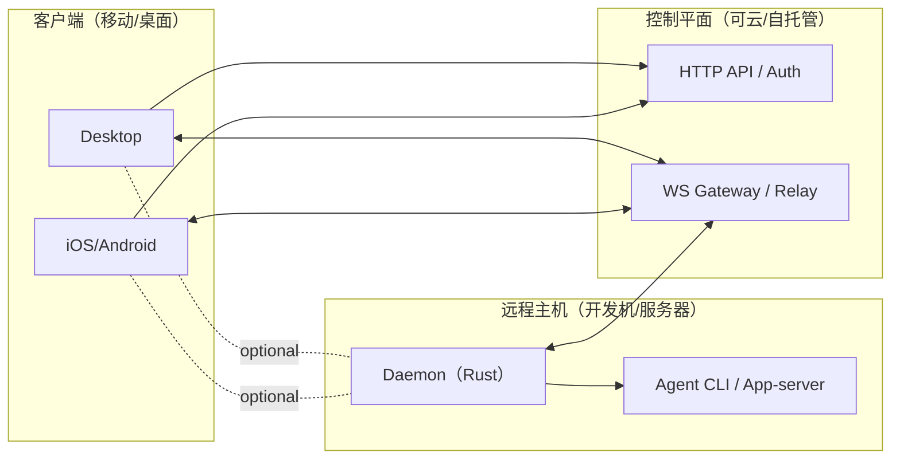
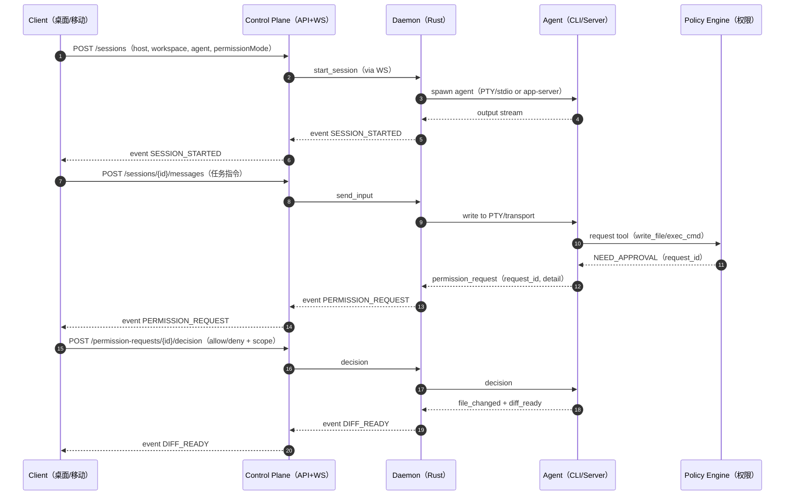

# 远程控制远程服务器 AI Agent 的移动端与桌面端应用 PRD

## 执行摘要

本项目拟打造一款面向开发者的跨端应用（iOS/Android + Windows/macOS/Linux），用于**远程控制运行在远程服务器/开发机上的 AI coding agent 会话**（例如 opencode、claudecode、codex 这类 CLI/桌面端 agent），覆盖从“发起任务 → 监督执行 → 审批高风险操作 → 审阅产出（diff/日志/测试）→ 接管修复/回滚 → 留痕审计/导出”的完整闭环。市场信号显示：一方面，用户强烈希望 Codex Desktop 支持 SSH/远程工作区而非仅限本地项目，远程开发（GPU/云主机/内网）是高频真实场景。citeturn14search2turn14search4turn14search9turn14search0 另一方面，Claude Code 推出 Remote Control，明确把“跨设备继续本地会话、对中断自动重连、远端只是窗口而会话在本地运行”等能力作为核心体验，验证了“跨端接力 + 会话不中断”的产品方向。citeturn15search0turn0search0 同时，开源竞品（Paseo/Happy/Vibe-remote）已验证基本形态：Daemon 在开发机/服务器上跑 agent，移动/桌面/Web 客户端远程连接；其中 Paseo 还提供“可选 E2EE relay（不可信中继）”的安全设计，Happy 强调端到端加密与移动端控制体验，Vibe-remote 则走“聊天平台ChatOps中控台”路线。citeturn1search1turn14search1turn1search0turn1search2

**目标（Goal）**  
在不引入社交属性（feed/关注/群聊/公开分享墙等）的前提下，提供**开发体验优先**的远程会话工作台：  
- 远程多会话管理（并行、隔离、恢复）  
- 文件浏览/检索/差异审阅与轻量编辑  
- 终端/REPL（PTY）与结构化运行结果（测试/构建）  
- 多 agent 接入与切换（STDIO/PTY、app-server、MCP 插件）  
- 权限模型（分层/模式/规则）+ 多用户协作（审批/审阅）但无社交  
- 离线/断线重连与带宽优化  
- 安全（OIDC/SSO、E2EE 可选、审计日志）  
- 云部署或自托管（运维、升级、监控）

**范围边界（Non-goals）**  
- 不做“远程桌面/屏幕控制”类产品（RDP/VNC/全桌面远控），本项目聚焦“远程开发会话与产物控制”。  
- 不做开放式社交：不提供公开分享链接默认打开（例如 OpenCode 的公开分享链接能力属于“社交/外部分享”范畴，需在本产品中默认禁用或改为组织内共享并受权限控制）。citeturn13search5  
- 不把第三方聊天平台作为主交互入口（Vibe-remote 的 Slack/Discord/Telegram/Wechat/Lark 是参考对象，但本产品以原生客户端为主；聊天平台可作为可选插件/通知通道，默认关闭）。citeturn1search2  

**成功指标（Success Metrics，建议上线后按周/月度追踪）**  
- 远程价值：远程会话创建数、跨端接力次数（desktop→mobile、mobile→desktop）、移动端完成审批/审阅次数。citeturn15search0  
- 交付效率：从任务发起到“可审阅产出（diff/测试结果）”的中位时间（TTFR：Time To First Reviewable）。  
- 稳定性：断线后自动重连成功率；事件流丢失率（应依赖 cursor 补偿趋近于 0）；移动网络下终端交互延迟 p95。  
- 安全与可控：高风险工具调用（写文件/执行命令/网络访问）被正确拦截并完成审批的比例；审计日志完整率与导出成功率。citeturn15search1turn15search2  
- 成本：单位会话带宽与存储成本（日志、diff、artifact）。

---

## 用户画像与移动端、桌面端使用场景

### 用户画像

本产品主要面向“以远程环境为主的工程开发”与“需要跨设备监督/审批”的开发者群体：

- **远程开发工程师（主用户）**：代码与依赖在远程 Linux 服务器/开发机（云主机、GPU、内网集群），需要 agent 直接在远程环境读写文件、跑命令、跑测试；对“本地项目限制”不满。citeturn14search2turn14search4turn14search12  
- **代码审查者/技术负责人（高价值用户）**：希望在手机上快速审阅 diff、确认风险操作、给出反馈，不必一直坐在电脑前。Claude Code Remote Control 强调“终端/浏览器/手机交替发送消息并同步对话”，这与审查者场景高度契合。citeturn15search0  
- **值班/可靠性工程师（on-call）**：弱网与断线重连非常重要；需要可审计、可回滚的远程操作面板（终端 + 日志 + 变更摘要）。  
- **安全/平台工程（次要但关键影响者）**：关注 SSO、权限策略落地、审计与合规以及自托管运维能力。

### 典型使用场景

**桌面发起、移动跟进（长任务监督）**  
1) 工程师在桌面端选择“主机 + workspace + agent”，下发任务（实现功能/修 bug/跑测试）。  
2) agent 运行期间触发权限请求（写文件/执行命令），或产出可审阅 diff/测试报告。  
3) 用户离开工位后用手机完成审批、审 diff，并追加指令。  
该体验与 Claude Code Remote Control 的“在桌面启动任务，去沙发用手机继续；并在中断后自动重连”的官方描述一致。citeturn15search0  

**多会话并行与隔离（worktree/sandbox）**  
同一仓库并行跑多个 agent（实现新功能、修复回归、补测试），每个会话使用独立工作目录以避免互相覆盖；`git worktree` 机制支持同一仓库多 working tree 并行。citeturn5search2turn11search3（SSH 通道复用与远程执行是远程环境常见需求）同时，Claude Code Remote Control 文档明确提供并行会话/容量与 worktree 等控制能力（不同语言版本页面对 flag 说明更完整），说明该模式在一线工具中已经被产品化。citeturn15search0turn15search4  

**企业自托管与审计（强权限要求）**  
- 管理员要求：所有高风险操作必须审批并留痕；权限规则可版本化、分发到组织内；并提供“权限模式”来在速度与安全之间切换。Claude Code 的权限文档明确给出“分层权限系统（只读/Bash/文件修改）+ 允许/询问/拒绝规则 + 权限模式”等可借鉴结构。citeturn15search1turn15search5  

---

## 目标、范围边界与成功指标

### 产品目标的可执行定义

本项目不是“再造一个 IDE”，而是“远程 agent 会话的开发控制面板”。落地时应聚焦以下可执行目标：

- **远程会话闭环**：无论 agent 是通过 STDIO/PTY 运行，还是通过 app-server/协议运行，都能在客户端完成：创建/查看/中断/恢复/审阅/审批。citeturn13search3turn0search2  
- **安全可控**：默认最小权限；权限请求可路由到移动端审批；权限规则可配置并可审计。citeturn15search1turn15search7  
- **跨端一致性**：移动端轻量“监督/审批/审阅”，桌面端重度“编辑/终端/调试”。  
- **可云可自托管**：参考 Paseo “daemon 自托管 + 可选 relay + 可本地直连或自建 tunnel”的组合，提供多种部署路径。citeturn1search12turn14search1turn1search1  

### 范围边界（明确不做与延后做）

- **不做（MVP 与 GA 都不做）**  
  - 社交关系与内容分发：关注/粉丝/公开动态/社区。  
  - 面向公众的会话“公开分享链接”：OpenCode 明确支持公开分享对话链接且“任何持链接者可访问”，此能力与企业安全边界冲突，应在本项目默认禁用，并改为组织内受控共享。citeturn13search5  
- **可做但默认关闭（P1/P2 插件）**  
  - 将事件推送到聊天平台（与 Claude Code channels 或 Vibe-remote 类似）。Claude Code channels 允许从 MCP server 推送事件到运行中的会话，并可选择中继权限提示用于远程批准/拒绝工具使用；但 channels 本身处于研究预览并有版本与登录限制，这提示我们：对外部通道应做成可插拔扩展，默认不依赖。citeturn15search7turn13search8turn13search1  

### 成功指标与观测埋点（建议 MVP 就内置）

- 会话维度：创建成功率、会话平均时长、并行会话数、被中断次数、重连次数。citeturn15search0  
- 权限维度：权限请求数、批准率/拒绝率、平均审批耗时、规则命中率（allow/ask/deny）。citeturn15search1turn15search5  
- 产出维度：diff 产出次数、测试执行次数与失败率、artifact 下载率。  
- 可靠性：WS 断连率、cursor 补偿重放次数、事件乱序/重复处理次数（需幂等）。  
- 安全：非授权访问拦截次数、token 失效/刷新次数、审计导出次数。

---

## 核心功能清单与优先级、MVP 定义及交互流程

### 功能优先级总表（P0/P1/P2）

下表用于直接进入工程拆分估算（以“模块→可交付能力”组织）：

| 模块 | P0（MVP 必须，形成闭环） | P1（Beta：可日用） | P2（增强：差异化/规模化） |
|---|---|---|---|
| 主机纳管与 Daemon | 一键安装/启动；主机注册、心跳、版本；出站连接（无需开入站端口的 relay 模式优先）citeturn15search0turn1search1 | 主机组/标签；资源上报（CPU/Mem/Disk）；在线升级与回滚 | K8s/VM 编排支持（Pod/微虚拟机模板）citeturn10search3turn10search1 |
| 远程会话管理 | 创建/暂停/终止/中断；多会话并行；会话状态机与恢复；会话导出（日志+diff） | 会话模板（agent/权限/环境）；会话回放（时间线） | 会话对比（A/B）、自动化批处理 |
| 文件浏览/差异审阅 | 目录树、搜索、只读预览；基于 git diff 的变更视图 | 轻量编辑（移动端小改、桌面端中等编辑）；冲突检测与文件锁 | 协同编辑（CRDT：Yjs/Automerge 取舍）citeturn7search1turn7search2 |
| 终端/REPL（PTY） | 远程 PTY；实时输出；可复制/粘贴；多 tab（桌面）citeturn11search16turn6search2 | 预置命令面板；结构化命令结果（exit code、耗时） | 高级会话录制/回放；性能采样 |
| 运行与调试 | Run 配置（test/build/run）；结构化测试报告（pass/fail + 日志片段） | DAP 调试接入（桌面优先）citeturn6search1 | 覆盖率/基准测试报告 |
| AI agent 接入与切换 | 统一 Agent Adapter：STDIO/PTY 驱动 + app-server 驱动两类；会话内切换 agent；多 agent 并行 | MCP 插件能力（工具/上下文扩展）citeturn7search7turn15search7 | 插件市场/配置中心（企业） |
| 权限与协作（无社交） | RBAC（组织/项目/会话）；审批工作流；共享会话（只读/可审批/可写）citeturn15search1turn15search7 | 审阅批注（贴在 diff/事件上）；审批委托（on-call） | 组织策略托管、SIEM 对接 |
| 断线重连与离线 | 自动重连；cursor 补偿；移动端离线缓存（最近日志/diff）citeturn15search0turn5search4 | 离线队列（消息/审批幂等提交） | 全量离线编辑与 CRDT 合并 |
| 性能与带宽 | 增量事件流；压缩；大文件分块与按需加载 | 自适应降采样（弱网） | QUIC/多路复用（可选，非 MVP）citeturn5search1turn3search3 |
| 审计与日志 | 不可变审计日志；导出 | 哈希链（防篡改）与签名 | 合规报表与长期存证 |
| 认证与安全 | TLS；短期 token；设备绑定；OIDC/SSO（P1 可先支持本地账户）citeturn5search3turn12search0 | E2EE（可选）参考 Paseo “不可信 relay”模型citeturn14search1turn12search1 | 零信任策略与密钥托管集成 |
| 部署与运维 | Docker Compose 一键；备份；基本监控 | Helm/K8s；灰度升级 | 多 region/HA |

### MVP 范围定义（必须交付的“最小可用闭环”）

MVP 必须能在远程服务器真实开发环境实现以下链路（可作为验收脚本）：

1) **纳管主机**：在远程 Linux 服务器安装并启动 Rust Daemon，Daemon 以出站连接接入（可不开放入站端口）。citeturn15search0turn1search1  
2) **创建会话**：选择 workspace（repo/目录）、选择 agent（至少支持两种：如 Codex app-server 或 OpenCode CLI）。citeturn13search3turn0search3  
3) **实时查看输出**：客户端能实时看到 agent 输出与终端输出（PTY），并能发送输入/指令。citeturn11search16turn6search2  
4) **权限审批闭环**：当 agent 要执行高风险动作（写文件/执行命令），客户端弹出审批；批准后继续执行，拒绝后终止该动作并记录审计。权限模型参考 Claude Code 的分层权限与权限模式思想。citeturn15search1turn15search5  
5) **产物可审阅**：能查看变更 diff、测试结果与关键日志片段；可导出会话包（日志+diff+审计）。  
6) **断线可恢复**：移动网络断开后，重连能继续看到会话并补齐事件（cursor replay）。Claude Code Remote Control 在官方文档中明确“中断后恢复/自动重连”的预期。citeturn15search0turn5search4  

### 关键交互流程与 Mermaid 图

#### 连接模式总览（直连 vs Relay）



该设计与 Paseo “daemon + 多客户端连接 + 可选 relay（可不可信）”的公开描述一致，并且其安全文档明确 relay 设计为不可信，端到端加密保护消息与代码不被 relay 读取。citeturn1search1turn14search1  

#### 会话创建与权限审批（时序图）



权限形态建议参考 Claude Code：其文档给出“允许/询问/拒绝规则”和分层权限（只读、Bash、文件修改）以及权限模式（例如 dontAsk 等），便于在 CI/受限环境实现完全非交互式策略。citeturn15search1turn15search5  

#### UI 核心界面草图（ASCII 线框）

移动端（监督/审批/审阅优先）：

```text
[会话列表]
- ses #128 运行中 | 主机: gpu-01 | 最近事件: 2m前 执行 `pytest`
- ses #127 待审批 | 需要批准: 写入 src/auth.rs
- ses #126 已完成 | 产出: 3 files changed | tests: pass

[会话详情]
顶部摘要: 项目 / 分支 / agent / 权限模式 / 运行时长 / 网络状态
事件时间线: 输出片段、工具调用、权限请求（可展开）
Tabs: 产出Diff | 日志 | 终端(只读/轻交互) | 审计
底部操作: 追加指令 | 批准/拒绝 | 中断 | 回滚
```

桌面端（重度开发控制台）：

```text
左栏: 主机/项目/会话树
中栏: 会话列表（过滤: 运行中/待审批/失败）
右侧: 会话工作区
- 上: Diff（Monaco/CodeMirror）+ 批注
- 中: 文件树 + 搜索
- 下: 终端（xterm.js）多tab
状态栏: 连接/带宽/重连/光标cursor
```

桌面端采用 Web 技术栈时，终端与编辑器组件可直接复用行业成熟方案：xterm.js 自述支持 bash/vim/tmux 等终端应用且具备性能与可访问性能力；Monaco Editor 是 VS Code 的编辑器内核；CodeMirror 为可扩展 Web 代码编辑器组件。citeturn6search2turn6search7turn7search0  

---

## 技术架构与组件选型（Rust 后端优先、客户端栈对比、通信协议与运行隔离）

### 总体架构与职责划分（Rust 后端优先）

建议采用“三层 + 可选 relay”的稳定形态：

- **Daemon（Rust，部署在远程主机）**：  
  - 管理会话生命周期（spawn、interrupt、资源限制）  
  - 封装 PTY/STDIO、文件读写、git diff、artifact 生成  
  - 连接 control plane/relay（出站 WS/gRPC）  
  - 可选：容器/Pod/microVM 隔离执行（见后文）  
  Paseo 公开说明其 daemon 负责管理 coding agents，多端客户端连接 daemon。citeturn1search1  

- **Control Plane（Rust，云或自托管）**：  
  - 身份认证（OIDC/SSO）、RBAC、设备绑定  
  - 会话元数据与审计存储  
  - WebSocket Gateway（事件流路由、cursor）  
  - 可选 relay：为 NAT/移动网络提供中继  
  Claude Code Remote Control 说明其将 claude.ai/code 或移动端 Claude 应用连接到本机会话，强调“会话本地运行，远端只是窗口”，这种模式本质也是“控制面+路由+本地会话”。citeturn15search0turn0search0  

- **客户端（移动/桌面）**：  
  - 移动端：监督/审批/diff 审阅/轻量编辑  
  - 桌面端：多会话并行、终端、编辑器、调试器（DAP/LSP 可选）

### Rust Web 框架选型对比（actix/tokio/hyper/tide/axum）

> 说明：Tokio/Hyper 更偏“底座”，Actix/Axum/Tide 更偏“框架层”。Tokio 官方定位为异步运行时与网络应用构建模块。citeturn2search3turn2search7

| 候选项 | 定位 | 优点 | 风险/缺点 | 成熟度/生态线索 | 推荐场景 |
|---|---|---|---|---|---|
| Actix Web | Rust Web 框架 | 官方强调“极快/务实/功能丰富”citeturn2search0turn2search8；生态较成熟 | 与 Tower 生态整合不如 Axum 自然（需团队经验） | Actix 官方站与仓库活跃citeturn2search8turn2search4 | 若团队熟悉 Actix，适合高吞吐 API/WS |
| Axum | Tokio 生态 Web 框架 | 与 Tokio/Hyper/Tower 深度融合；docs.rs 指出其明确基于 tokio+hyperciteturn2search17turn2search1；中间件生态（Tower）丰富 | 性能与纯 Hyper 存在差距讨论（需压测验证）citeturn2search9 | Tokio 系生态中长期维护预期高citeturn2search3turn2search1 | 推荐默认：Control Plane API + WS Gateway |
| Hyper | HTTP 底层库 | 官方定位“低层 building block、性能领先、生产广泛使用”citeturn3search0turn3search8 | 开发成本高；业务 API 需要自建路由/中间件 | Hyper 官方与 docs 完备citeturn3search4turn3search8 | 核心网关/极致性能组件（非首选） |
| Tide | Async Web 框架 | 仓库声明“最小化、务实、快速开发”citeturn2search2turn2search6 | 生态相对收敛；与主流 Tokio 栈协作成本 | HTTP-rs 体系较早期路线citeturn2search10 | 小型服务或工具型 daemon（谨慎） |
| Tokio | 异步运行时 | 官方描述覆盖 I/O、网络、调度、计时等，是构建网络应用底座citeturn2search3turn2search19 | 不是 Web 框架；需搭配 Axum/Hyper/Tonic 等 | “Tokio stack”包含 Hyper/Tonic/Tower 等citeturn2search3 | Daemon 与 Control Plane 的统一运行时 |

**建议（可执行）**  
- **Control Plane（Rust）**：默认 **Tokio + Axum**（HTTP API + WS Gateway），内部微服务可用 **Tonic（gRPC）**。citeturn3search2turn3search6  
- **Daemon（Rust）**：Tokio 为主；对外连接使用 WS（tokio-tungstenite 或 axum ws），PTY 用 portable-pty；需要 SSH 工具链时可评估 russh。citeturn3search1turn11search16turn11search6  

### 通信协议选型：WebSocket vs gRPC vs QUIC vs SSH（含 relay/NAT）

#### 关键约束
- 需要**实时**：终端流、agent 流式输出、事件时间线。  
- 需要**弱网与移动网络适配**：断线重连、cursor 补偿、可降采样。  
- 需要**易跨端**：WebView/Tauri/Flutter/Kotlin 都能稳定接入。  
- 需要**可自托管**：不强依赖特定云。  
- 需要**NAT 穿透/无入站端口（优先）**：参考 Claude Code Remote Control “本地运行、远端窗口、自动重连”的产品目标。citeturn15search0turn0search0  

#### 协议对比表

| 协议 | 适合本项目哪些流量 | Rust 侧库/实现线索 | 客户端支持与代价 | NAT/Relay 友好度 | 建议采用 |
|---|---|---|---|---|---|
| WebSocket（RFC6455） | 事件流、终端流、agent 输出流 | tungstenite 支持 RFC6455citeturn3search17turn5search4；tokio-tungstenite 提供 Tokio 绑定citeturn3search1；Axum/Actix 均可承载 WSciteturn2search0turn2search17 | Web/JS 原生；Tauri 前端直接用浏览器 WS；Flutter/Kotlin 也可用成熟实现（实现成本低） | 高：非常适合“双方出站连 relay” | **MVP 首选**（实时流核心） |
| gRPC（HTTP/2） | 结构化 API、内部微服务、可双向流式 RPC | Tonic 是 Rust gRPC 实现，强调高性能与互操作citeturn3search2turn3search6 | Flutter 有 pub.dev grpc 包citeturn16search0；Kotlin 官方 quickstart/实现citeturn16search1turn16search13；Web 端需 gRPC-Web + proxy（浏览器限制导致协议不同）citeturn16search10turn16search2 | 中：仍需网关/反代；Web 端要额外 proxy | **P1 可选**（内部服务优先，客户端先不强上） |
| QUIC（RFC9000） | 高抖动/移动网络、连接迁移（path migration）需求 | Quinn 是 Rust IETF QUIC 实现citeturn3search3turn5search1 | 客户端跨端 QUIC 生态不如 WS/gRPC 普遍；Web 端受限；移动端引入成本高 | 中：UDP 可能被网络策略限制；需要更复杂穿透 | **P2 研究**（非 MVP，先用 WS + 优化） |
| SSH（RFC4253/4254） | 安装/救援/隧道（port-forward）、少量管理动作 | SSH 提供加密、认证、完整性保护citeturn5search2turn11search3；Rust 侧可评估 russh（微软也维护 fork）citeturn11search6turn11search2 | 客户端直接实现 SSH 成本大；但可依赖 OpenSSH 与隧道（用户已有） | 取决于网络；SSH 常被允许但也可能受限 | **用于 bootstrap 与 tunneling**（不是主数据面） |

**结论**  
- **MVP：REST（HTTP）+ WebSocket（事件流/终端）**。WebSocket 作为实时主通道具备跨端最强可用性，且标准化（RFC6455）。citeturn5search4turn3search17  
- **P1：内部微服务引入 gRPC（Tonic）**；客户端仅在 Flutter/Kotlin 桌面/移动明确受益且团队熟悉时逐步引入；Web/Tauri 前端可通过 gRPC-Web+proxy，但应评估复杂度。citeturn3search6turn16search10turn16search2  
- **P2：QUIC（Quinn）作为可选加速层**，主要针对极端弱网与移动网络连接迁移（RFC9000 抽象提到低延迟建连与路径迁移等能力）。citeturn5search5turn3search7  

### 终端/PTY、编辑器、LSP/DAP 与 CRDT 取舍

- **PTY（远程终端）**：Rust 侧建议使用 portable-pty（跨平台 PTY API，docs.rs 明确其提供跨平台伪终端接口，并可在运行时选择实现）。citeturn11search16turn11search8  
- **桌面端终端 UI**：Web 技术栈优先 xterm.js（支持主流终端应用，性能与可访问性能力明确）。citeturn6search2  
- **编辑器 UI**：  
  - Monaco Editor：官方说明其为 VS Code 的编辑器内核。citeturn6search7turn6search3  
  - CodeMirror：官方定义为可扩展 Web 代码编辑器组件。citeturn7search0turn7search12  
- **LSP（代码智能）**：LSP 规范由微软维护，目标是让编辑器与语言服务通过统一协议提供智能能力（补全、跳转等）。citeturn6search8turn6search0 OpenCode 文档明确其与 LSP servers 集成，用诊断信息反馈给 LLM。citeturn13search9  
- **DAP（调试）**：DAP 规范定义 IDE 与 debugger 的协议，是远程调试可标准化的路径。citeturn6search13turn6search1  
- **CRDT（协同/离线编辑）取舍**：  
  - Yjs：明确为 CRDT 实现，支持变更分发与无冲突合并。citeturn7search1turn7search17  
  - Automerge：提供多 CRDT、紧凑格式与同步协议。citeturn7search2turn7search18  
  **建议**：P0/P1 不做“多人同文件实时协同编辑”，先做“文件锁 + diff 审阅 + 合并”。CRDT 在 P2 引入，并限制为“会话内注释/任务清单/轻量文档”先行，避免引爆权限与审计复杂度。

### 容器/VM 支持：Docker / K8s / Firecracker

- Docker：官方定义“容器是隔离进程并共享内核”，适合成本较低的会话级隔离。citeturn10search2  
- Kubernetes Pod：K8s 文档说明 Pod 是工作负载基本单元（可进一步结合资源配额）。citeturn10search3turn10search17  
- Firecracker microVM：官方介绍其面向安全多租户，微虚拟机兼具 VM 隔离与容器速度，并给出启动与创建速率指标；适合强隔离场景（企业/多租户）。citeturn10search1turn10search0  

**建议路径**  
- P0：宿主机执行 + 最小权限 + 审批。  
- P1：可选 Docker 隔离（每会话容器，挂载 workspace）。citeturn10search2  
- P2：K8s Pod 或 Firecracker（依企业需要选型）。citeturn10search3turn10search1  

### agent 接入方式：STDIO/PTY、app-server、MCP 插件

本产品的关键是把“多 agent”统一为一个抽象接口（Agent Adapter），并支持三种主流接入形态：

1) **STDIO/PTY 驱动（通用）**：把 agent 当子进程，通过 PTY/STDIO 读写。OpenCode CLI 默认启动 TUI，也支持命令式调用（便于程序化）。citeturn0search3turn0search15  
2) **app-server/远程协议驱动（优选结构化）**：Codex 提供 app-server，并支持 WebSocket transport；CLI 文档明确可用 `codex --remote ws://...` 连接到 app-server，并提供 token 鉴权方式（capability token、signed bearer token 等）。citeturn0search2turn13search3turn13search15turn13search7  
3) **MCP 插件扩展（生态方向）**：MCP 规范将 LLM 应用与外部工具/数据源标准化连接；Claude Code 将 channels 定义为“把事件推入运行中会话的 MCP server”，并可选择中继权限提示用于远程批准/拒绝。citeturn7search7turn15search7turn13search1  

---

## 数据模型与 API 设计（REST + WebSocket 事件流、权限模型、cursor、artifact 存储）

### 关键实体与关系（建议的最小数据模型）

- Org / Project / Workspace  
- User / Role / Device（设备绑定、公钥、推送 token）  
- Host（主机/daemon 实例、能力上报、版本、标签）  
- Session（会话：agent、workspace、权限模式、状态机）  
- Event（append-only 事件流：用于同步/回放/审计）  
- PermissionRequest（审批对象：工具类型、目标、风险等级、建议 scope）  
- Artifact（diff、测试报告、构建产物）  
- AuditLog（不可变审计记录：谁在何时批准/拒绝/执行了什么）

### 权限模型（可直接进入实现）

参考 Claude Code 的“分层权限系统 + 规则 + 模式”结构：  
- 分层：只读 / Bash / 文件修改（不同是否需要批准、批准影响范围不同）citeturn15search1  
- 规则：allow / ask / denyciteturn15search1turn0search1  
- 模式：例如 dontAsk（自动拒绝所有未明确允许操作，用于 CI/受限环境）citeturn15search5  

**本产品建议定义：**

- ToolType：`READ_FS`、`WRITE_FS`、`EXEC_CMD`、`NETWORK`、`MCP_TOOL`  
- Decision：`ALLOW_ONCE`、`ALLOW_SESSION`、`ALLOW_PROJECT`、`DENY`  
- Scope：path glob、command pattern、domain allowlist 等  
- PermissionMode：`ASK`、`DONT_ASK`、`AUTO_ACCEPT_EDITS`（命名可与 Claude Code 对齐便于理解）

### API 设计原则

- **REST 负责“命令式控制”**：创建会话、发送消息、提交审批、获取 artifact。  
- **WebSocket 负责“实时事件流”**：输出流、终端流、权限请求、文件变更、测试结果。  
- **事件流 cursor**：客户端断线后通过 cursor 补偿重放，确保一致性与可恢复。  
- **幂等键**：对审批/消息提交必须可幂等，避免离线重试导致“双重批准”。

### REST API（示例）

```http
POST /v1/sessions
{
  "host_id": "host_01",
  "workspace_id": "ws_99",
  "agent": { "type": "codex_app_server", "endpoint": "ws://127.0.0.1:4500" },
  "permission_mode": "ASK",
  "session_name": "fix-login-bug"
}
```

```http
POST /v1/sessions/{session_id}/messages
{
  "idempotency_key": "msg_20260413_0001",
  "content": "修复登录回归，补测试并跑全量测试"
}
```

```http
POST /v1/permission-requests/{request_id}/decision
{
  "idempotency_key": "apr_20260413_0009",
  "decision": "ALLOW_SESSION",
  "scope": {
    "tool_type": "EXEC_CMD",
    "command_prefix": "pytest",
    "cwd": "/workspaces/repo"
  }
}
```

### WebSocket 事件流（示例）

连接：

```text
wss://{gateway}/v1/sessions/{session_id}/events?cursor={cursor}
```

事件载荷（示例）：

```json
{
  "type": "PERMISSION_REQUEST",
  "ts": "2026-04-13T10:20:30Z",
  "cursor": "01J0...ULID",
  "session_id": "ses_123",
  "data": {
    "request_id": "pr_456",
    "tool_type": "WRITE_FS",
    "target": "src/auth.rs",
    "summary": "Edit authentication logic and update tests",
    "risk": "MEDIUM",
    "suggested_scopes": [
      { "decision": "ALLOW_ONCE" },
      { "decision": "ALLOW_SESSION", "path_prefix": "src/" }
    ]
  }
}
```

### Artifact 存储（diff/报告/日志包）

- **对象存储（S3 API）**：Amazon S3 提供官方 API 参考；MinIO 提供 S3 兼容对象存储并有 S3 API 兼容文档；适合保存大型 artifact（日志包、构建产物）。citeturn9search0turn9search9turn9search13  
- **元数据（Postgres）**：PostgreSQL 文档对事务与 ACID 术语有明确描述，适合“会话元数据 + 权限规则 + 审计索引”。citeturn9search6turn9search2  
- **本地嵌入式（SQLite，可选）**：SQLite WAL 模式可提升并发读写体验，适合 daemon 本地缓存或单机部署元数据。citeturn9search3  

---

## 非功能需求、安全与认证、部署与运维、里程碑计划与风险、竞品对比

### 非功能需求（SLO 级别，可直接写入测试与验收）

- **实时性 SLO**  
  - 移动网络下终端输入→回显 p95 < 250ms（基础交互）；  
  - 事件流端到端延迟（Daemon→Client）p95 < 500ms；  
  - 重连恢复：断线 30s 内重连后 cursor 补齐完成 p95 < 2s。citeturn15search0turn5search4  
- **可靠性 SLO**  
  - 控制平面月可用性 99.9%（自托管可选 HA）；  
  - 事件流丢失率≈0（依赖 cursor 幂等消费）。  
- **扩展性目标**  
  - 单 Host 支持 N 并行会话（配置项），并能限制资源；K8s 可用 Pod resource requests/limits。citeturn10search17  

### 安全与认证（具体实现建议）

#### 认证与 SSO
- **OIDC/SSO**：OpenID Connect Core 规范定义基于 OAuth 2.0 的认证层；用于企业 SSO 对接。citeturn5search3  
- MVP 可先支持本地账户/Token，Beta 引入 OIDC。

#### 传输安全
- 所有外部连接必须 TLS；Rust TLS 可用 rustls（其仓库声明默认禁用过时加密并支持 TLS1.2/1.3）。citeturn12search0turn12search4  

#### 设备绑定与短期 token
- 设备首次配对：设备生成 keypair，服务端签发设备证书/绑定记录；后续 WS 连接使用短期 token（例如 5–15 分钟）并可滚动刷新。  
- 对“审批”动作必须要求强验证（最近登录/二次确认/生物识别由客户端实现）。

#### E2EE（可选，但建议 P1 支持）
- Paseo 安全文档明确 relay 设计为不可信，端到端加密让 relay 无法读取消息与代码，也无法在不被检测的情况下篡改流量，这是强参考模板。citeturn14search1  
- 实现思路（建议）：  
  - 每设备长期公钥；会话建立时协商 session key；  
  - 消息/事件载荷使用对称 AEAD（例如 libsodium secretbox 思路：加密 + 完整性标签）。citeturn12search1  
  - server 仍保存必要元数据（会话状态、时间戳、cursor、大小等），内容密文存储；审计可保留哈希摘要与元数据。  

#### 审计与防篡改
- 所有权限请求/审批/命令执行/文件写入生成审计事件（append-only）。  
- P1 引入“哈希链”：每条审计记录包含上一条 hash，形成不可篡改链（结合对象存储导出）。

### 部署与运维（云与自托管）

- **自托管基础形态（MVP）**：Docker Compose：Control Plane + DB + object storage（可选） + relay（可选）。Docker 官方文档介绍容器与镜像/运行实例的基本概念，可作为部署说明引用。citeturn10search8turn10search2  
- **企业形态（P1/P2）**：Helm/K8s：组件拆分（api、ws-gw、auth、worker、db、nats/redis），Pod 资源配额与水平扩展。citeturn10search6turn10search17  

### Rust 数据库/队列/存储选型（工程可落地对比）

| 类别 | 候选 | 优点 | 风险/代价 | 引用线索 |
|---|---|---|---|---|
| DB 访问层 | SQLx | 异步纯 Rust，支持编译期检查 SQL、支持 PostgreSQL/MySQL/SQLiteciteturn8search0 | 需要迁移管理与 SQL 规范；编译期检查需额外配置 | citeturn8search0 |
| DB 访问层 | SeaORM | ORM 特性丰富（过滤/分页/嵌套查询）并自称 production-readyciteturn8search1turn8search5 | ORM 学习与性能/SQL 可控性权衡 | citeturn8search1 |
| 事件队列/流 | NATS JetStream | 官方说明 JetStream 支持消息存储与回放，适合事件流与 worker queueciteturn8search2turn8search14 | 引入组件与运维成本 | citeturn8search2 |
| 事件队列/流 | Redis Streams | Redis 文档称 Streams 是 append-only log 数据结构citeturn8search3turn8search15 | 语义与消费组细节复杂；HA 方案需设计 | citeturn8search3 |
| Artifact 存储 | S3/MinIO | S3 API 官方参考；MinIO 提供 S3 兼容说明citeturn9search0turn9search13 | 权限与生命周期管理需配置 | citeturn9search0 |

### 客户端技术栈对比（Flutter vs Kotlin CMP vs Tauri2+Vue3）

> 用户偏好：后端 Rust；客户端可选 Flutter、Kotlin CMP 或 Tauri2+Vue3。下表给出“可执行建议”。

| 方案 | 平台覆盖 | 优点 | 风险/代价 | 与 Rust 互操作关键点 | 建议 |
|---|---|---|---|---|---|
| Flutter | iOS/Android/桌面 | 跨端成熟；移动端体验一致；可用 Platform Channels 调原生能力citeturn4search0turn4search4；可用 dart:ffi 绑定原生库citeturn4search5turn4search9 | 自建终端/编辑器组件成本较高（常需 WebView/自研）；桌面端原生感需打磨 | Platform Channels / dart:ffi（必要时封装 Rust 为 C ABI）citeturn4search0turn4search5 | **推荐：移动端优先选 Flutter**（P0/P1 最稳） |
| Kotlin CMP（Compose Multiplatform） | Android/iOS/桌面（Web beta） | JetBrains 官方说明支持 iOS/Android/桌面，Web 为 betaciteturn4search7turn4search19；KMP expect/actual 支持平台差异化citeturn4search2turn4search6 | iOS 生态与三方组件相对 Flutter 少；团队若非 Kotlin 栈学习成本 | Rust 互操作：Android JNI/NDK，iOS cinterop（工程复杂） | **推荐：若团队 Kotlin 强且偏 Android，可选** |
| Tauri2 + Vue3 | 桌面 +（官方宣称含移动） | Tauri v2 网站写明支持 Linux/macOS/Windows/Android/iOS，Rust 写应用逻辑、前端用任意框架citeturn1search3turn1search7；安全上有 capabilities 系统用于约束前端暴露面citeturn1search22 | 移动端相对新；iOS toolchain/构建复杂度较高（官方 develop 文档提到 iOS 构建阶段会编译 Rust 库并被加载）citeturn1search13 | 与 Rust 天然同语言（client 也可复用部分 Rust 逻辑） | **推荐：桌面端首选 Tauri2+Vue3**；移动端是否用 Tauri 取决于团队接受风险 |

**综合建议（最可执行的组合）**  
- **桌面端：Tauri2 + Vue3**（可直接复用 xterm.js/Monaco/CodeMirror 生态，且 Tauri 后端为 Rust）。citeturn1search7turn6search2turn6search7  
- **移动端：Flutter**（工程成熟度与生态更稳；如需深度系统能力用 Platform Channels/FFI）。citeturn4search0turn4search5  
- 若团队 Kotlin 生态深厚且希望统一 Kotlin：可评估 Compose Multiplatform（iOS/Android/桌面）但需在编辑器/终端组件上投入更多。citeturn4search7turn4search2  

### 里程碑与实施计划（周级估算、Alpha/Beta/GA）

> 预算与团队规模未指定：以下以“1 PM + 1 设计 + 2 Rust 后端/daemon + 2 客户端（1 移动 1 桌面）+ 1 QA/DevOps 兼职”的典型小团队节奏估算。若人力更少，周期按比例拉长。

| 周期 | 目标 | 交付范围（可验收） | 验收标准（摘录） |
|---|---|---|---|
| 第 1–2 周（Alpha-0） | 技术打底 | Rust Daemon：PTY 通道 + 基本文件读取 + WS 连接；Control Plane：最小 API + WS 网关；桌面端原型（会话列表/日志流） | 能在远程主机跑一个“假会话”并实时看到输出citeturn11search16turn5search4 |
| 第 3–4 周（Alpha-1） | 闭环跑通 | 支持 1–2 个 agent：OpenCode CLI（命令式触发）+ Codex app-server（WS transport）；权限请求/审批最小闭环；移动端原型（审批/查看）citeturn0search3turn13search3turn0search2 | 能完成：创建会话→触发写文件/执行命令→手机批准→生成 diff→导出 |
| 第 5–7 周（Beta） | 可日用 | 文件树/搜索/差异审阅；移动端 diff 审阅；断线重连 + cursor 补偿；RBAC v1；审计导出 | 断网 30s 后重连不丢事件；权限审计可追溯citeturn15search0turn15search1 |
| 第 8–10 周（Beta+） | 可自托管 | Docker Compose 一键部署；备份恢复；基础监控；性能优化（增量 diff、压缩、分块）citeturn10search2turn10search8 | 自托管环境部署<30分钟；大仓库目录与 diff 可用 |
| 第 11–14 周（GA） | 企业可用 | OIDC/SSO；策略托管；容器隔离（Docker 可选）；更完整运维（升级/回滚）citeturn5search3turn10search2 | SSO 登录与 RBAC 生效；隔离模式可配置；SLO 达标 |

### 风险与缓解措施

- **风险：多 agent 适配易碎（CLI 输出格式变化、交互提示变化）**  
  - 缓解：优先对接“结构化协议”能力（如 Codex app-server 的 WS transport 与鉴权模式），CLI 适配走“最小依赖 + 契约测试”。citeturn13search3turn13search15turn0search2  
- **风险：远程开发强需求但网络/弱网体验差**  
  - 缓解：WS 主通道 + cursor 补偿；可降采样；移动端离线缓存；对齐 Claude Code Remote Control 的“中断后自动重连”体验预期。citeturn15search0turn5search4  
- **风险：安全边界不清导致“可用但不敢用”**  
  - 缓解：默认 ASK 权限模式；提供 dontAsk（受限环境）；规则可版本化分发；审批与审计不可缺省，参考 Claude Code 权限体系。citeturn15search1turn15search5  
- **风险：Tauri 移动端成熟度与构建复杂度**  
  - 缓解：桌面优先 Tauri，移动优先 Flutter；如坚持全 Tauri，需预留 iOS toolchain 风险缓冲（官方 develop 文档明确 iOS 构建阶段会编译 Rust 库并在运行时加载）。citeturn1search13turn1search3  

### 竞品功能对比表（含 eanoai 资料不足标注）

> 说明：对 eanoai 未找到与“远程控制 AI agent 开发会话”直接对应的官方/开源材料；同时 “Eano” 在公开网站上更像建筑/施工协作软件，与本项目领域不一致，因此按“资料不足/同名混淆可能”处理。citeturn0news38turn13search10turn10search6turn5search17turn13search6turn1search3turn15search0turn14search2turn1search1turn1search0turn1search2turn0search3turn0search2turn13search3

| 维度 | eanoai | Happy | Paseo | Vibe-remote | Claude Code（参考能力） | OpenCode（参考能力） | Codex（参考能力） |
|---|---|---|---|---|---|---|---|
| 基本定位 | 资料不足/可能同名混淆citeturn0news38 | 移动/Web 控制 Claude Code/Codex，强调 E2EEciteturn1search0turn1search8 | daemon 管理 agents，多端连接；可选 E2EE relayciteturn1search1turn14search1 | 用聊天平台指挥，多通道实时流citeturn1search2 | Remote Control：跨设备继续本地会话、自动重连citeturn15search0turn0search0 | CLI+桌面/IDE，LSP、多会话；有公开分享链接citeturn13search13turn13search9turn13search5 | app 项目/线程、多任务、可审 diff；app-server/remote WSciteturn13search2turn13search3turn0search2 |
| 多端（移动+桌面） | ? | iOS/Android/Webciteturn1search0 | iOS/Android/桌面/Web/CLIciteturn1search1 | 依赖聊天客户端多端citeturn1search2 | iOS/Android + browser/terminal（官方）citeturn15search0 | 终端/IDE/桌面（官方）citeturn0search7turn13search13 | 桌面 app（官方）citeturn13search6turn13search2 |
| 安全模型 | ? | E2EE（宣称）citeturn1search0turn1search8 | relay 不可信 + E2EE（官方文档）citeturn14search1 | 主要靠平台通道与最小暴露面citeturn1search2 | 权限规则/模式体系完善citeturn15search1turn15search5 | 有分享链接（需谨慎）citeturn13search5 | app-server WS 鉴权模式明确citeturn13search15turn13search7 |
| 权限/审批 | ? | 有（产品主打）citeturn1search8 | 依赖 agent 本身 + 客户端控制 | 以命令流为主 | 权限分层+模式+rulesciteturn15search1turn15search5 | 规则（AGENTS.md）偏引导citeturn0search19 | sandbox/鉴权策略较明确citeturn13search15turn0search2 |
| 本项目可借鉴点 | — | 移动端监督/通知 + E2EE 方向 | daemon 形态 + 可选 relay 的产品化 | 多通道路由（但本项目不以社交为主） | “跨端继续会话 + 自动重连 + 权限体系” | LSP 融合与并行会话 | app-server 结构化接入 + 多项目 multitask |

image_group{"layout":"carousel","aspect_ratio":"16:9","query":["Paseo daemon clients screenshot","Happy mobile app Claude Code client screenshot","Claude Code Remote Control mobile interface screenshot","OpenAI Codex app features screenshot diff review"],"num_per_query":1}

### 必要示意图/截图链接与优先参考资料（中文优先，官方/开源优先）

> 按用户要求：以下提供可直接交给产品/设计/工程查阅的“优先参考链接”（含截图/示意）。为避免在正文插入大量裸链接，统一放在代码块中。

```text
【Claude Code（官方中文）】
Remote Control（远程控制/跨端继续会话/自动重连）:
https://code.claude.com/docs/zh-CN/remote-control

权限系统（分层权限、规则、可版本化分发）:
https://code.claude.com/docs/zh-CN/permissions

权限模式（如 dontAsk 等，用于受限/CI）:
https://code.claude.com/docs/zh-CN/permission-modes

Hooks（生命周期钩子，可做通知/阻断/注入上下文）:
https://code.claude.com/docs/zh-CN/hooks
https://code.claude.com/docs/zh-CN/hooks-guide

Channels（MCP server 推事件进会话；可选中继权限提示远程审批；研究预览限制）:
https://code.claude.com/docs/zh-CN/channels
https://code.claude.com/docs/zh-CN/channels-reference

【OpenCode（官方）】
CLI（命令式与 TUI）:
https://opencode.ai/docs/cli/
LSP Servers（与 LSP 集成，用诊断反馈 LLM）:
https://opencode.ai/docs/lsp/
Share（公开分享链接；本项目需默认禁用/改为受控共享）:
https://opencode.ai/docs/share/

【Codex（OpenAI 官方）】
Codex App Features（多项目、多线程、diff 审阅）:
https://developers.openai.com/codex/app/features
Introducing the Codex app（产品描述：多 agent 并行、线程内审 diff 等）:
https://openai.com/index/introducing-the-codex-app/
Codex App Server（ws transport）:
https://developers.openai.com/codex/app-server
Codex CLI reference（--remote / ws-auth / token 等）:
https://developers.openai.com/codex/cli/reference
Codex CLI features（capability token / signed bearer token）:
https://developers.openai.com/codex/cli/features
Codex Desktop 远程开发诉求（用户反馈/issue）:
https://github.com/openai/codex/issues/10450
https://github.com/openai/codex/issues/15616

【开源竞品】
Paseo（daemon + 多客户端 + 可选E2EE relay）:
https://github.com/getpaseo/paseo
https://paseo.sh/
Paseo Security（relay 不可信 + E2EE 说明）:
https://paseo.sh/docs/security

Happy（移动/Web client，强调 E2EE）:
https://github.com/slopus/happy
https://happy.engineering/

Vibe-remote（聊天平台指挥；可作为“可选插件通道”参考）:
https://github.com/cyhhao/vibe-remote

【协议与标准】
WebSocket RFC6455:
https://datatracker.ietf.org/doc/html/rfc6455
QUIC RFC9000:
https://datatracker.ietf.org/doc/rfc9000/
SSH RFC4253/4254:
https://datatracker.ietf.org/doc/html/rfc4253
https://datatracker.ietf.org/doc/html/rfc4254
OpenID Connect Core 1.0:
https://openid.net/specs/openid-connect-core-1_0.html

【客户端与框架】
Tauri v2:
https://v2.tauri.app/
Tauri capabilities（安全能力约束）:
https://v2.tauri.app/security/capabilities/
Flutter Platform Channels:
https://docs.flutter.dev/platform-integration/platform-channels
Flutter FFI:
https://docs.flutter.dev/platform-integration/bind-native-code
Kotlin Multiplatform expect/actual:
https://kotlinlang.org/docs/multiplatform/multiplatform-expect-actual.html
Compose Multiplatform:
https://kotlinlang.org/compose-multiplatform/
```

**补充说明：关于政治/社交限制与隐私**  
本 PRD 已将“社交功能”作为明确非目标；若未来需要外部通知/IM 通道，建议严格以“插件/通知通道”形式存在，且默认关闭，并遵循“最小披露”（只推送需要用户输入/审批/失败告警的摘要，不推送代码内容），这一点也与 Claude Code channels“事件推入会话、可中继权限提示”的定位一致。citeturn15search7turn13search1